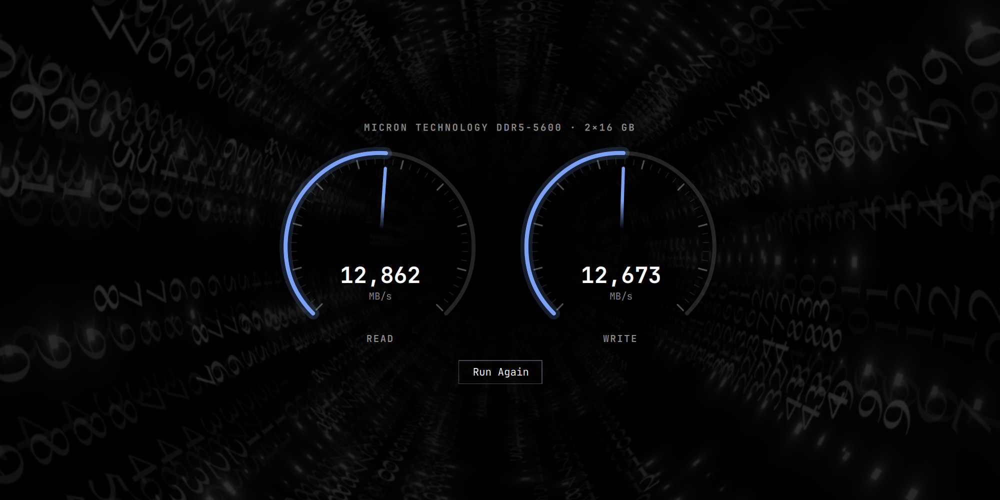
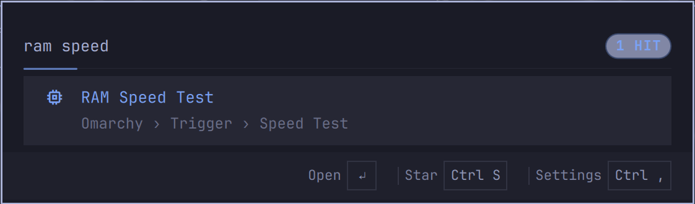

<div align="center">

# RAM Speed Test

**The speed test Omarchy was missing: your memory, on the same gauge cluster as the network and disk tests.**



[](https://omarchy.org)
[](LICENSE)


</div>

---

Omarchy ships **Network Speed Test** and **Disk Speed Test**. Your network gets dials. Your NVMe gets dials. The 32 GB of DDR5 that every single instruction runs through gets... nothing.

Now it gets dials.

## It *is* the built-in cluster

This is not a lookalike. Omarchy's network and disk tests both render through one shared component, `qs.Ui/SpeedTestOverlay`, and this plugin drives that exact component. Same floating 270° dials on a deep scrim, same ignition sweep on open, same hubless gradient needles, same auto-ranging scale, same **Run Again**, same Esc-to-dismiss. When Omarchy restyles its cluster, this restyles with it.

`Panel.qml` is a line-for-line sibling of Omarchy's own `disk-speedtest/Panel.qml`. Only the command and the scale changed.

## Right where you'd look for it

**Menu › Trigger › Speed Test › RAM Speed Test**, next to the other two. Search it from the launcher too:

<div align="center">



</div>

## What it measures

**Single-threaded memory bandwidth**, the same figure `mbw` and `sysbench memory` report:

| Phase | What moves | Why it's honest |
|---|---|---|
| **READ** | 1 GiB buffer → 1 MiB cache-hot block | The 1 GiB buffer dwarfs L3, so every pass hits DRAM |
| **WRITE** | 1 MiB cache-hot block → 1 GiB buffer | The 1 MiB block lives in L2, so the DIMMs are the bottleneck, not the cores |

- **8 seconds per phase**, one live reading a second, and the needle glides between them.
- **First second thrown out** (governor ramp, THP settling). The dial settles on the steady-state average.
- **Pages pre-faulted with real data** before anything is timed, so you measure DRAM and not the kernel handing out zero pages.
- **Never takes more than a quarter of available memory.** The buffer halves itself on a tight box, and the test refuses to run rather than push you into swap.
- **Names your hardware without root.** The title comes from the SMBIOS table udev already exposes: `MICRON TECHNOLOGY DDR5-5600 · 2×16 GB`.
- **MB/s, like the disk test,** so the two are directly comparable. Spoiler: RAM wins.

### Reference

| Machine | Memory | Read | Write |
|---|---|---:|---:|
| Intel Core Ultra 9 290HX Plus | Micron DDR5-5600 SODIMM, 2×16 GB | 12,862 MB/s | 12,673 MB/s |

Run it on yours and open a PR to add a row.

## Install

```bash
omarchy plugin add https://github.com/nixfred/ram.speed.test --enable
```

Then run it:

```bash
omarchy-shell shell summon nixfred.ram-speedtest
```

### Put it in the menu

Add one line to `~/.config/omarchy/extensions/omarchy-menu.jsonc`. Omarchy's menu and the launcher both pick it up live, no restart needed:

```jsonc
"trigger.tests.ram-speedtest": {"icon":"󰍛","label":"RAM Speed Test","aliases":["ram-speedtest","memtest"],"action":"omarchy-shell shell summon nixfred.ram-speedtest"},
```

### Headless

The backend speaks the same line protocol as `omarchy-disk-speedtest`, so it works fine in a terminal:

```console
$ python3 ram-speedtest
ram Micron Technology DDR5-5600 · 2×16 GB
read 11653
read 11921
...
write 12996
```

## Requirements

- Omarchy with the shared speed-test overlay (the release that ships **Disk Speed Test**)
- `python3`, which Omarchy already has. Nothing else. No `sysbench`, no `mbw`, no root.

## Not a stability test

This measures **speed**. It does not hunt for bad bits. If you suspect faulty RAM, boot **memtest86+**.

## License

[MIT](LICENSE) © Fred Nix
